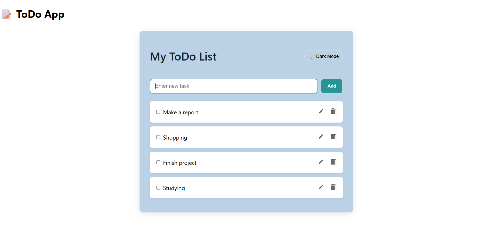
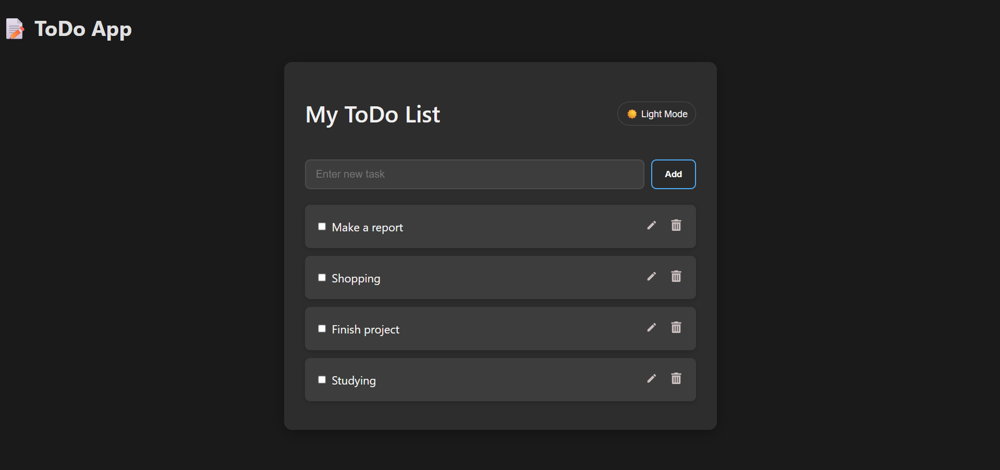

# 📝 Full-Stack ToDo List App  

A modern **ToDo List application** built with **React (frontend)** and **Spring Boot (backend)**. The app supports **full CRUD operations**, task management, and a sleek **dark/light mode UI**.  

---

## ✨ Features  
- ➕ Add, ✏️ Edit, 🗑️ Delete tasks  
- ✅ Mark tasks as complete (with strikethrough effect)  
- 🌗 Dark/Light mode toggle for eye-friendly UI  
- 🎨 Clean, modern design with intuitive icons  
- 🔗 REST API integration with Spring Boot backend  
- 📱 Responsive design (desktop & mobile)  

---

## 🛠 Tech Stack  
**Frontend:** React.js (with React Icons, Axios)  
**Backend:** Spring Boot (Java)  
**Database:** MySQL  
**Tools:** Git, Postman  

---

## 📸 App Preview  

  
  
  

---

## 🔮 Future Improvements

* ⏰ Task deadlines with reminders
* 📲 Mobile app (React Native)
* 🎙️ Voice command support
* ☁️ Deployment with Docker + Cloud Hosting

---

## 🤝 Contributing

Contributions are welcome! Feel free to fork this repo and submit a PR.

---

